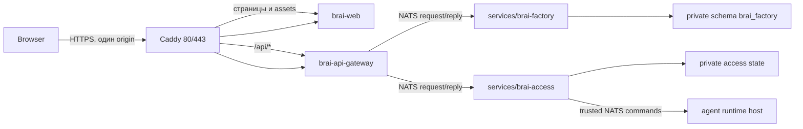

# Общая архитектура Brai New

**Статус:** `active`  
**Тип:** explanation  
**Проверено по:** `README.md`, `compose.yml`, package manifests, OpenSpec и
README компонентов на `2026-07-19` UTC

Brai New — микросервисный фундамент с одним внешним HTTP edge, внутренним
NATS bus и сервисами-владельцами данных. Такой разрез нужен, чтобы web и
Gateway не получали database credentials, а прикладные сервисы не начинали
ходить друг к другу по произвольному HTTP.

## Системная схема

Внешний трафик входит через Caddy. Браузерный JavaScript отправляет
same-origin `/api/*`; именно Caddy направляет его в Gateway, поэтому между
`brai-web` и Gateway нет прямого межсервисного HTTP-канала. Gateway является
HTTP/NATS edge, но не владельцем прикладной базы. Factory владеет Activity и
своей схемой. Access владеет транзакционным состоянием доступа и не имеет
публичного HTTP endpoint.

Точная карта контейнеров, сетей, loopback bindings, subjects и data ownership
находится в [справочнике микросервисной топологии](../reference/microservice-topology.md).
Причины устойчивых границ зафиксированы в
[ADR о NATS-центричной архитектуре](../decisions/20260719-adopt-nats-service-owned-architecture.md),
[ADR о доступе агентов](../decisions/20260719-adopt-server-selected-agent-access.md)
и [ADR о immutable delivery](../decisions/20260719-adopt-immutable-artifact-delivery.md).

## Первый вертикальный срез

1. Web отправляет `POST /api/v1/activities` или запрос списка на same-origin
   Gateway.
2. Gateway проверяет схему запроса, request id и idempotency key.
3. Gateway отправляет NATS request/reply в Factory.
4. Factory записывает Activity в свою приватную схему и возвращает результат.
5. Web показывает подтверждённый ответ или честную ошибку; сетевой/серверный
   сбой не превращается в ложный успех.

Нормативные сценарии Activity находятся в
[`openspec/specs/brai-factory/spec.md`](../../openspec/specs/brai-factory/spec.md),
а HTTP-форма описана в [`apps/api-gateway/README.md`](../../apps/api-gateway/README.md)
и [`apps/web/README.md`](../../apps/web/README.md).

## Граница доступа агентов

Access profile выбирается trusted server code из глобального server-side
состояния пользователя до запуска runtime. Существуют ровно
`user-sandbox` и `developer`; модель, prompt, клиент и процесс не могут
выбрать или повысить профиль.

Обычный пользователь получает одну постоянную среду и одну hard quota для всех
своих агентов и проектов. Developer runtime работает от `mark` с тем же sudo
контрактом, что Codex Desktop. Переключение профиля заменяет живые runtime, а
не меняет права уже работающего процесса.

Подробности и edge cases:

- [Нормативный agent-access контракт](../../openspec/specs/agent-access/spec.md)
- [Техническая архитектура доступа](../agent-access-architecture.md)
- [Понятное объяснение прав и квот](../permissions-and-isolation.md)

## Границы данных

| Компонент      | Владеет                                | Не получает                                       |
| -------------- | -------------------------------------- | ------------------------------------------------- |
| Web            | UI и same-origin client state          | NATS credentials, database credentials            |
| Gateway        | HTTP edge и request validation         | Database credentials, access decision             |
| `brai-factory` | Activity и schema `brai_factory`       | Публичный HTTP surface, чужую схему               |
| `brai-access`  | Access state и launch lifecycle        | Решение от модели/клиента, публичный HTTP surface |
| User sandbox   | Данные пользователя внутри своей quota | Brai checkout, host root/socket, platform secrets |

## Trade-offs

- NATS добавляет отдельный bus и ACL, но делает межсервисное взаимодействие
  явным и не раздаёт каждому сервису произвольный HTTP доступ.
- Service-owned schemas требуют нескольких migration/role paths, но уменьшают
  blast radius database credential.
- Static web export упрощает runtime и поверхность атаки, но серверная логика
  должна оставаться в Gateway/backend.
- Одна среда на обычного пользователя экономит дисковую и операционную
  сложность, но агенты одного владельца находятся в одном trust domain.

## Что не следует выводить из этой схемы

Эта страница не доказывает production readiness и не заменяет host acceptance.
Факт установленного runtime, Caddy, backup или deployment tooling проверяется
по соответствующим operator README и `/home/mark/DEPLOYMENT.md`.
