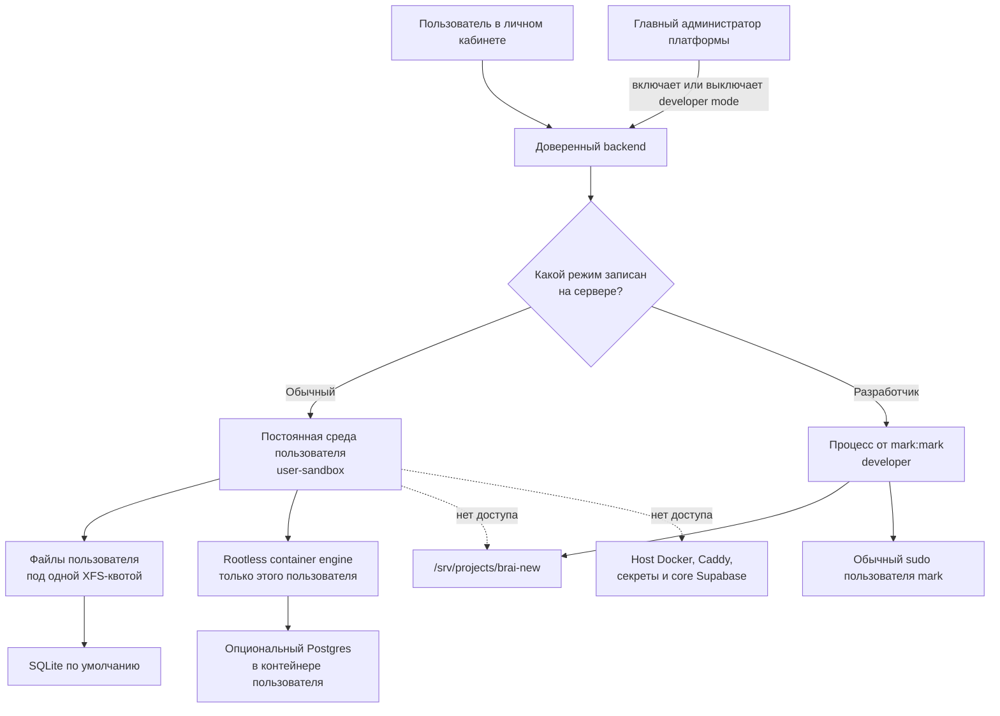
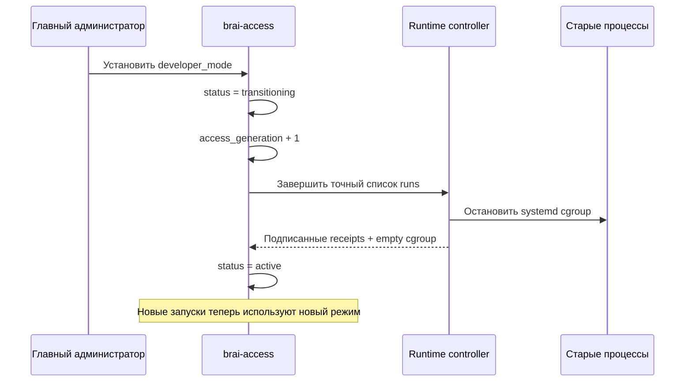

# Как устроены права, пользовательские среды и дисковые квоты в Brai New

> Документ для владельца продукта, разработчика и администратора сервера.
> Сначала система объясняется простыми словами. В конце находится технический
> справочник с путями, сервисами и командами проверки.

**Статус:** реализовано и проверено на сервере  
**Дата контрольной проверки:** 18 июля 2026 года  
**Нормативный контракт:** [`openspec/specs/agent-access/spec.md`](../openspec/specs/agent-access/spec.md)

---

## Короткий ответ

В Brai New есть только два режима работы агента:

| Режим                    | Для кого                                 | Что агент может                                                           |
| ------------------------ | ---------------------------------------- | ------------------------------------------------------------------------- |
| Обычный, `user-sandbox`  | Для всех обычных пользователей           | Работать только в постоянной изолированной среде своего пользователя      |
| Разработчик, `developer` | Только для явно доверенного пользователя | Работать на сервере как Linux-пользователь `mark`, включая обычный `sudo` |

Главные правила:

1. **Агент не выбирает себе права.** Режим выбирает доверенный серверный код до запуска процесса.
2. **Никакого “агента прав” нет.** Ни одна модель, подсказка или специальный агент не решает, можно ли повысить доступ.
3. **Одна среда на пользователя.** Десять агентов одного пользователя работают в одной среде, а не создают десять копий проекта.
4. **Квота — это лимит, а не бронь.** Если пользователю установлен лимит 5 ГиБ, эти 5 ГиБ не вычитаются из свободного места заранее.
5. **У проекта один штатный Linux-владелец.** Codex Desktop и developer web-agents работают как `mark:mark`.
6. **Права живого процесса не меняются.** При переключении режима старые процессы завершаются, затем запускаются новые.
7. **Ошибки не “лечатся” через `chmod -R` или `chown -R`.** Если системная граница повреждена, запуск блокируется с понятной причиной.

> [!IMPORTANT]
> Система не пытается угадать намерение агента. Она сначала помещает процесс в
> правильную операционную среду, а уже потом передаёт ему задачу.

---

## Содержание

- [Почему раньше возникали проблемы](#почему-раньше-возникали-проблемы)
- [Словарь простыми словами](#словарь-простыми-словами)
- [Общая схема](#общая-схема)
- [Как выбирается режим](#как-выбирается-режим)
- [Обычная пользовательская среда](#обычная-пользовательская-среда)
- [Как устроено хранение и квоты](#как-устроено-хранение-и-квоты)
- [Как пользователь запускает контейнеры](#как-пользователь-запускает-контейнеры)
- [Какие базы данных доступны пользователю](#какие-базы-данных-доступны-пользователю)
- [Как работает режим разработчика](#как-работает-режим-разработчика)
- [Что происходит при переключении режима](#что-происходит-при-переключении-режима)
- [Почему агенты больше не спорят из-за владельцев файлов](#почему-агенты-больше-не-спорят-из-за-владельцев-файлов)
- [Как система ведёт себя при ошибке](#как-система-ведёт-себя-при-ошибке)
- [Технический справочник](#технический-справочник)
- [Проверка состояния сервера](#проверка-состояния-сервера)
- [Что было проверено](#что-было-проверено)
- [Честные ограничения](#честные-ограничения)
- [Частые вопросы](#частые-вопросы)

---

## Словарь простыми словами

| Термин            | Что он означает в этом документе                                                                                 |
| ----------------- | ---------------------------------------------------------------------------------------------------------------- |
| Backend           | Доверенная серверная программа, которая проверяет пользователя и запускает нужный режим                          |
| Runtime           | Часть системы, которая непосредственно создаёт, отслеживает и завершает процесс агента                           |
| Sandbox           | Изолированная Linux-среда, из которой не видны проект Brai и закрытые части сервера                              |
| Slot              | Постоянный номер пользовательской среды, из которого вычисляются её Linux UID/GID и XFS project ID               |
| UID/GID           | Числовые идентификаторы владельца файлов и группы в Linux                                                        |
| User namespace    | Механизм ядра, который делает внутреннего `root` обычным непривилегированным UID на хосте                        |
| Rootless engine   | Docker-совместимый container engine, работающий без прав `root` сервера                                          |
| Sparse-файл       | Файл с большим логическим максимумом, который физически растёт только при записи                                 |
| XFS project quota | Ограничение дискового места для целого дерева каталогов, которое принудительно применяет ядро                    |
| Inode             | Учётная единица файла или каталога; inode-квота ограничивает не только байты, но и количество файлов             |
| cgroup            | Механизм Linux, который ограничивает CPU, память, swap и число процессов                                         |
| Preflight         | Проверка всех обязательных условий до запуска процесса                                                           |
| Fail closed       | При сомнении запуск запрещается; система не выдаёт более широкие права “на всякий случай”                        |
| Generation        | Номер версии прав пользователя; старый номер нельзя использовать после переключения режима                       |
| Receipt           | Подписанное техническое доказательство того, что runtime действительно запустил или завершил нужный process tree |

Технические названия сохранены там, где они помогают найти точный unit, путь
или поле в коде. При первом чтении достаточно понимать правую колонку.

---

## Почему раньше возникали проблемы

Проблемы с Linux-правами обычно появляются не потому, что Linux “плохой”, а
потому, что один каталог изменяют процессы с разными владельцами.

Типичный старый сценарий выглядел так:

1. один агент создавал файл как обычный пользователь;
2. другой процесс запускался через `sudo` и создавал соседний файл как `root`;
3. CI, deploy или контейнер добавлял каталог от третьего пользователя;
4. следующий агент получал `Permission denied`;
5. кто-то запускал рекурсивный `chmod` или `chown`;
6. временно становилось лучше, но ломался другой процесс.

Дополнительные источники путаницы:

- отдельные worktree или клоны на каждую задачу;
- root-owned build cache внутри рабочего проекта;
- общий host Docker socket;
- SQLite-файл одного владельца и WAL-файлы другого;
- процессы, которым меняли права во время работы;
- административные credentials основной базы у прикладного кода.

В новой архитектуре устраняется причина, а не очередной симптом:

- каждый вид процесса заранее имеет одну понятную среду;
- проект пишет только `mark`;
- пользовательские данные пишет только числовая identity этого пользователя;
- системные сервисы не пишут в исходники;
- запуск блокируется, если фактические права не совпадают с контрактом.

---

## Общая схема



В схеме нет промежуточного “решателя прав”. Backend читает уже сохранённое
значение и выбирает один из двух заранее реализованных путей.

---

## Как выбирается режим

### Источник решения

Источник решения — глобальная серверная настройка пользователя
`developer_mode`.

- `false` → `user-sandbox`;
- `true` → `developer`.

Изменить эту настройку может только главный администратор платформы.
Администратор отдельного пользовательского проекта не может выдать доступ ко
всему серверу.

### Что приходит от браузера

Обычный публичный запрос на запуск содержит только:

- идентификатор проекта;
- текст задачи агента.

Идентификатор пользователя берётся из проверенной сервером сессии. В запросе
нет доверенных полей `profile`, `uid`, `owner`, `developer_mode`,
`access_generation` или пути на сервере.

Если клиент всё же присылает лишние поля, строгая схема отклоняет запрос.

### Что получает runtime

После проверки пользователя, проекта и режима backend создаёт короткоживущий
подписанный контракт запуска. Он связан с конкретными:

- запуском;
- пользователем;
- проектом;
- пользовательской средой;
- runtime-host;
- режимом;
- поколением доступа;
- лимитом хранения;
- неизменяемой командой и её SHA-256 digest.

Максимальная жизнь такого контракта — пять минут. Старый, повторно
использованный, изменённый или подписанный неизвестным ключом контракт не
запускает процесс.

> Простыми словами: браузер просит “выполни задачу”, а сервер сам вкладывает в
> защищённый конверт ответ на вопрос “где и с какими правами”.

---

## Обычная пользовательская среда

### Одна среда на одного пользователя

Обычный пользователь получает:

- одну постоянную изолированную Linux-среду;
- один постоянный каталог данных;
- одну дисковую квоту;
- один числовой slot;
- один rootless container engine.

Количество агентов, задач и проектов внутри этой среды не увеличивает число
slot и не создаёт полную копию системы.

```text
Пользователь Сергей
└── одна постоянная среда
    ├── агент 1
    ├── агент 2
    ├── агент 3
    ├── проект A
    ├── проект B
    ├── SQLite-файлы
    └── контейнеры и их volumes
```

Агенты одного пользователя считаются одной доверенной областью. Они могут
видеть общие файлы своего владельца. Изоляция защищает:

- одного пользователя от другого;
- всех обычных пользователей от платформы и исходников Brai.

### Что пользователь видит

Внутри среды есть:

- неизменяемая базовая Linux-система;
- writable-каталог `/data`;
- домашний каталог и caches внутри `/data`;
- рабочие проекты пользователя;
- временные файлы внутри `/data`;
- Docker API только его rootless engine.

### Чего пользователь не видит

Обычная среда не получает:

- `/srv/projects/brai-new`;
- корень файловой системы хоста;
- `/home/mark` и `/root`;
- host Docker/containerd/Podman socket;
- Caddy config или credentials;
- platform secrets;
- core NATS credentials;
- core Supabase credentials;
- данные другого пользователя.

### Что означает `root` внутри среды

Пользователь может иметь root-подобные права внутри своей изолированной
системы. Это не `root` сервера.

Linux user namespace переводит внутренние UID/GID в отдельный высокий диапазон
UID/GID хоста. Поэтому внутренний `root` не становится UID `0` снаружи и не
может управлять сервером.

### Почему нет копии на каждого агента

Базовый образ подключается read-only и используется совместно. Для нового
агента не создаются:

- новый полный образ Linux;
- новый 5-гигабайтный файл;
- новый Git clone Brai;
- отдельный Docker daemon с копией всех binaries;
- новая дисковая квота.

Новый агент — это новый процесс внутри уже существующей среды пользователя.

---

## Как устроено хранение и квоты

### Отдельного диска нет

Хранилище находится на существующем серверном диске.

На ext4 создан один общий sparse-файл:

```text
/srv/brai-storage/user-data.xfs
```

Он содержит XFS-файловую систему и монтируется сюда:

```text
/srv/brai-user-data
```

**Sparse-файл** имеет заданный логический максимум, но физически занимает место
только по мере записи данных. Это один файл на всю систему, а не файл на
пользователя.

### Квота не резервирует место

Предположим:

- на диске свободно 40 ГиБ;
- пользователю A установлен лимит 5 ГиБ;
- пользователю B установлен лимит 10 ГиБ;
- оба пользователя пока ничего не записали.

После назначения лимитов свободное место останется почти тем же: 40 ГиБ за
вычетом небольших filesystem metadata. Система не бронирует 15 ГиБ.

Место расходуется только при реальной записи:

| Событие                            |      Реально занято |
| ---------------------------------- | ------------------: |
| Пользователю назначили лимит 5 ГиБ |             почти 0 |
| Он записал файл 600 МиБ            |       около 600 МиБ |
| Он удалил этот файл                | место освобождается |

Сумма пользовательских лимитов может быть больше физического свободного места.
Это намеренно: лимиты определяют максимум каждого пользователя, а не
гарантированный резерв.

### Что входит в лимит

В одну квоту пользователя входят:

- проекты и исходный код пользователя;
- home и состояние агентов;
- caches;
- temporary files;
- Docker images и writable layers;
- Docker build cache;
- named volumes;
- container logs;
- SQLite database, `-wal`, `-shm` и backups;
- Postgres `PGDATA` и dumps.

### Что происходит при достижении лимита

Ядро Linux отклоняет следующую запись с `EDQUOT`. Это означает
“пользовательская квота исчерпана”, а не “сломались права”.

После удаления части данных запись снова работает. Не требуется:

- менять владельца;
- менять mode;
- освобождать виртуальную бронь;
- пересоздавать среду.

### Защита всего серверного диска

Кроме пользовательской квоты есть общий предохранитель:

- проверяется свободное место внутри XFS pool;
- проверяется свободное место на внешнем ext4;
- сохраняется минимум 10% свободного пространства;
- при достижении порога новые launch/provision операции блокируются.

Уже запущенная произвольная программа всё равно может получить `ENOSPC`, если
закончится общий физический pool. Система отличает `ENOSPC` от пользовательского
`EDQUOT`.

### Текущие значения по умолчанию

Контракт задаёт стартовый лимит:

- **5 ГиБ данных**;
- **500 000 inode** — то есть файлов и каталогов.

Это не неизменяемая константа продукта. Доверенный backend может сохранить
другой лимит пользователя. Клиент и агент не могут подменить его при запуске.

---

## Как пользователь запускает контейнеры

### Почему нельзя дать host Docker socket

`/var/run/docker.sock` на сервере фактически даёт управление всем хостом.
Контейнер с таким socket может:

- смонтировать серверный `/`;
- прочитать secrets;
- остановить чужие контейнеры;
- запустить privileged container;
- изменить проект Brai.

Поэтому обычной пользовательской среде host socket не передаётся никогда.

### Один rootless engine на пользовательский slot

Для каждого созданного slot есть Linux service principal:

```text
brai-eng-<номер-slot-в-base36>
```

Например, первый slot использует `brai-eng-0`.

Это **не агент** и не отдельный участник системы. Это заблокированная
Linux-учётная запись:

- без пароля;
- без shell;
- без home;
- без SSH/login;
- с заранее рассчитанным UID/GID.

Она нужна только ядру Linux, чтобы процессы контейнерного engine имели
постоянного владельца.

### Где работает engine

Rootless Docker engine работает отдельным systemd unit на хосте, но:

- процесс не имеет host root;
- writable ему только quota-root этого пользователя;
- `/srv/projects`, homes, Caddy, runtime credentials и host sockets скрыты;
- его data root — `/data/docker`;
- его control socket видит только matching sandbox;
- binaries общие и установлены read-only в `/srv/opt/brai-user-engine`.

Socket внутри пользовательской среды выглядит привычно:

```text
DOCKER_HOST=unix:///run/user/1000/docker.sock
```

Поэтому пользователь может применять обычные Docker-команды, но эти команды
управляют только его rootless engine.

### Сеть контейнеров

Для rootless engine разрешён публичный исходящий интернет, но закрыты:

- private IPv4 networks;
- link-local addresses;
- публичный IP самого хоста;
- весь IPv6 в текущей версии;
- сети core-сервисов;
- сети других пользователей.

DNS rootless engine получает через виртуальный адрес slirp `10.0.2.3`.

### Домены и публикация проектов

Пользовательский контейнер не получает Caddy config или DNS credentials.
Публикация домена должна выполняться отдельным доверенным ingress-контуром,
который проверяет:

- владельца проекта;
- владельца hostname;
- внутренний port;
- актуальность подтверждения домена.

Эта access foundation создаёт безопасную среду, но не выдаёт пользователю
прямое управление Caddy.

---

## Какие базы данных доступны пользователю

### SQLite — вариант по умолчанию

Для большинства небольших пользовательских проектов SQLite проще и дешевле:

- не нужен отдельный сервер;
- нет отдельного порта;
- нет ролей в core Supabase;
- database-файл входит в обычную пользовательскую квоту.

Пакет `@brai/user-project-database`:

- требует Node.js 22.22.3+;
- использует SQLite 3.51.3+;
- создаёт database с mode `0600`;
- включает foreign keys;
- включает WAL;
- устанавливает `synchronous=NORMAL`;
- использует `busy_timeout` 5 секунд по умолчанию;
- ограничивает длительность транзакций;
- запрещает path escape и symlink alias;
- не разрешает WAL на известных небезопасных network/userspace filesystems.

Live backup создаётся SQLite Backup API, проверяется через
`PRAGMA quick_check`, синхронизируется и атомарно заменяет предыдущий backup.

> [!WARNING]
> Нельзя копировать только живой `.sqlite` через обычный `cp`: часть актуальных
> данных может находиться в `-wal`.

### Postgres — опционально

Если проекту действительно нужен Postgres, пользователь запускает его через
свой rootless engine.

Требования:

- immutable image digest вместо mutable tag;
- `PGDATA` внутри пользовательской квоты;
- private internal network;
- нет опубликованного host port;
- контейнерный root read-only;
- capabilities удалены;
- password-файл внутри user root с mode `0600`;
- dumps и temporary files входят в ту же квоту.

### Почему не выдаётся schema в основной Supabase

Пользовательский проект не получает:

- schema в core Supabase Brai;
- произвольную database role;
- service-role key;
- права создавать extensions;
- DDL-доступ к core tables;
- соединение с management network.

Так ошибка или вредоносный пользовательский проект не расширяет область
повреждения основной платформы.

Core-сервисы Brai используют свои приватные schemas и отдельные роли:

- migration role — только для контролируемых migrations;
- runtime role — только для необходимых запросов;
- connection limits и server-side timeouts;
- Gateway и web не получают database credentials.

---

## Как работает режим разработчика

### Для чего он нужен

Developer mode нужен для сценария, где Brai достраивает саму себя. Доверенный
пользователь запускает web-agent из личного кабинета, а агент может:

- читать и менять весь проект Brai New;
- запускать build и tests;
- менять конфигурацию;
- управлять инфраструктурой через `sudo`;
- выполнять ту же работу, что Codex Desktop.

### Какая Linux identity используется

Developer web-agent запускается как:

```text
user:  mark
group: mark
cwd:   /srv/projects/brai-new
umask: 0077
```

Перед запуском systemd заново получает supplementary groups пользователя
`mark`. Обычная работа с проектом выполняется без `sudo`.

Это означает:

- файл от Codex Desktop доступен web-agent;
- файл от web-agent доступен Codex Desktop;
- новые файлы имеют одного владельца `mark:mark`;
- root-owned build output не появляется при штатной работе.

### Когда используется sudo

`sudo` применяется только для реального системного действия:

- установка root-owned runtime artifact;
- изменение systemd unit;
- управление нужным сервисом;
- изменение инфраструктурного файла.

Весь агент не запускается как `root`. Процесс остаётся `mark`, а отдельная
системная команда вызывает обычный sudo-контракт `mark`.

### Preflight перед developer launch

Перед запуском проверяются:

- фактические UID/GID `mark`;
- актуальные supplementary groups;
- рабочий каталог;
- umask `0077`;
- writable checkout;
- владелец `mark:mark`;
- отсутствие foreign-owned entries;
- отсутствие world-writable source;
- отсутствие FIFO, socket и device внутри source tree;
- отсутствие symlink, уходящего за разрешённую границу;
- доступность полного `sudo -n` контракта.

Если проверка не проходит, агент не запускается. Система не делает
рекурсивный repair.

---

## Что происходит при переключении режима

Режим нельзя безопасно изменить у уже работающего процесса. Поэтому
переключение сделано как переход между поколениями.



Порядок действий:

1. backend блокирует access state пользователя;
2. записывает переход;
3. увеличивает `access_generation`;
4. сохраняет полный список живых runs;
5. блокирует новые запуски;
6. runtime controller завершает каждый точный process tree;
7. проверяется systemd unit, cgroup, PID identity и пустой cgroup;
8. отзываются старые внутренние credentials;
9. новый режим становится active.

Старый или неполный receipt не завершает переход. Timeout сам по себе тоже не
считается доказательством завершения процесса.

### Что происходит при ошибке запуска

Если runtime успел создать process tree, но подтверждение запуска не дошло до
access service:

1. run помечается как требующий termination;
2. runtime завершает сохранённый process tree;
3. подписывает доказательство пустого cgroup;
4. access service принимает доказательство;
5. только после этого публичный запрос считается окончательно неуспешным.

Так “неудачный” запрос не оставляет скрытый живой процесс.

---

## Почему агенты больше не спорят из-за владельцев файлов

### Проект Brai New

Штатный writer один:

```text
mark:mark
```

Источники не записываются:

- ordinary-user sandbox;
- runtime host service;
- migration runner;
- deploy process;
- rootless engine;
- system provisioning.

### Пользовательские данные

Каждый slot получает стабильный высокий UID/GID. Каталог пользователя имеет
этого владельца и mode `0700`.

UID/GID вычисляются, а не ищутся случайным образом:

```text
общий pool: 0x70000000..0x7FFDFFFF
размер slot: 131072 ID
число slot: 2047
```

Один slot принадлежит постоянной среде пользователя. Агент, задача или проект
не получают новый host UID.

### Контейнерные данные

Engine работает под UID/GID этого же slot и пишет Docker data в тот же
quota-root. Поэтому не возникает конфликта:

```text
workspace owner != Docker layer owner != backup owner
```

Все изменяемые данные остаются внутри одной заранее известной ownership-схемы.

### Системные файлы

Установленные artifacts в `/srv/opt` и systemd configuration принадлежат
`root:root`. Они меняются только как явное системное действие через sudo.

---

## Как система ведёт себя при ошибке

Основной принцип — **fail closed**: если система не может доказать безопасную
границу, она не запускает процесс с “примерно подходящими” правами.

| Проблема                                  | Поведение                    |
| ----------------------------------------- | ---------------------------- |
| Developer checkout имеет чужого владельца | Developer launch блокируется |
| Повреждена UID/GID reservation            | User sandbox блокируется     |
| Не измерена XFS-квота                     | User sandbox блокируется     |
| Неактивен firewall                        | User sandbox блокируется     |
| Rootless engine не отвечает на `_ping`    | Sandbox не считается готовым |
| Изменился immutable image digest          | Launch блокируется           |
| Закончилась квота пользователя            | Возвращается quota error     |
| Закончился общий pool                     | Возвращается pool-full error |
| Пришёл старый generation                  | Launch отклоняется           |
| Повторно прислали тот же run              | Второй процесс не создаётся  |
| Переключение режима не завершено          | Новые runs блокируются       |

Запрещённые “исправления”:

- fallback из `user-sandbox` в `developer`;
- запуск всего процесса как root;
- `chmod -R`;
- `chown -R`;
- автоматическая выдача более широких прав;
- создание второго writer проекта;
- передача host Docker socket.

---

## Технический справочник

### Основные пути

| Назначение                         | Путь                                                     |
| ---------------------------------- | -------------------------------------------------------- |
| Исходники проекта                  | `/srv/projects/brai-new`                                 |
| Постоянные пользовательские данные | `/srv/brai-user-data/<environment>`                      |
| Общий sparse XFS backing           | `/srv/brai-storage/user-data.xfs`                        |
| Логический ceiling XFS pool        | `/etc/brai-agent-runtime/storage-ceiling-bytes`          |
| Runtime binaries и scripts         | `/srv/opt/brai-agent-runtime`                            |
| Rootless engine binaries           | `/srv/opt/brai-user-engine`                              |
| Immutable sandbox image            | `/srv/opt/brai-agent-runtime/images/user-sandbox-v1.raw` |
| Защищённая runtime configuration   | `/etc/brai-agent-runtime`                                |
| Environment bindings               | `/etc/brai-agent-runtime/environments/<environment>.env` |
| Engine socket                      | `/run/brai-user-engines/<environment>/docker.sock`       |
| Runtime registry/gates             | `/var/lib/brai-agent-runtime`                            |

Secrets не хранятся в проекте и не должны попадать в документацию.

### Основные systemd units

| Unit                              | Роль                                                 |
| --------------------------------- | ---------------------------------------------------- |
| `brai-agent-runtime-host.service` | Проверяет контракты, запускает и завершает runs      |
| `brai-users.slice`                | Общий CPU/RAM/swap/tasks cap всех обычных сред       |
| `brai-user-storage-setup.service` | Проверяет и монтирует общий XFS pool                 |
| `srv-brai\x2duser\x2ddata.mount`  | XFS mount с `prjquota`                               |
| `brai-user-storage-trim.timer`    | Возвращает освобождённые sparse blocks внешнему ext4 |
| `brai-user-firewall.service`      | Загружает fail-closed nftables policy                |
| `brai-user-engine@.service`       | Rootless container engine конкретного slot           |
| `brai-user-sandbox@.service`      | Изолированная nspawn-среда конкретного пользователя  |

Instance units не включаются глобально “для всех”. Trusted runtime запускает
конкретную environment из проверенного server snapshot.

### Текущие resource limits

Фактические host limits задаются root-owned policy. Установленный reference:

| Уровень                                |  CPU |    RAM |    Swap |  Tasks |
| -------------------------------------- | ---: | -----: | ------: | -----: |
| Все ordinary users, `brai-users.slice` | 600% | 24 ГиБ |   4 ГиБ | 12 288 |
| Один sandbox                           |  50% |  1 ГиБ | 512 МиБ |    512 |
| Один rootless engine                   | 150% |  3 ГиБ | 1.5 ГиБ |  1 536 |

Перед запуском runtime повторно измеряет активный cgroup и сверяет его с
root-owned policy. Параметры клиента не участвуют.

### Сетевые границы

Sandbox использует:

- private network namespace;
- отдельный veth;
- nftables policy;
- запрет cross-user traffic;
- запрет host/core networks;
- platform-controlled ingress только отдельным доверенным путём.

Engine использует:

- RootlessKit;
- slirp4netns;
- разрешённый virtual DNS `10.0.2.3/32`;
- запрет RFC1918;
- запрет link-local;
- запрет IP хоста;
- запрет IPv6;
- public egress.

### Host ID pool

| Параметр                 | Значение                            |
| ------------------------ | ----------------------------------- |
| Principal reservation    | `brai-sandbox-map`                  |
| Полный диапазон          | `0x70000000..0x7FFDFFFF`            |
| Decimal start            | `1879048192`                        |
| ID на environment        | `131072`                            |
| Максимум environment v1  | `2047`                              |
| Engine UID/GID           | `slot_start + 1000`                 |
| Engine subordinate range | `slot_start + 65536`, count `65536` |
| XFS project ID           | `10000 + slot`                      |
| Environment label        | `brai-u-<base36-slot>`              |
| Engine principal         | `brai-eng-<base36-slot>`            |

`/etc/subuid` и `/etc/subgid` содержат exact whole-pool reservation. Перед
provisioning и launch проверяются passwd, group, shadow, subuid, subgid, NSS и
диапазон systemd-nspawn.

### Защита immutable image

Launcher:

1. открывает image и digest sidecar с `O_NOFOLLOW`;
2. проверяет root ownership и modes;
3. считает SHA-256 через уже открытый descriptor;
4. передаёт тот же descriptor в `systemd-nspawn`;
5. не открывает path повторно между проверкой и mount.

Это закрывает окно, в котором кто-то мог бы заменить image после проверки, но
до запуска.

---

## Проверка состояния сервера

Следующие команды только проверяют состояние. Они не меняют режим пользователя.

### 1. Проверить runtime и инфраструктуру

```bash
systemctl is-active \
  brai-agent-runtime-host.service \
  brai-user-storage-setup.service \
  brai-user-firewall.service
```

Ожидаемый результат для каждой строки:

```text
active
```

### 2. Проверить host UID/GID pool

```bash
sudo /srv/opt/brai-agent-runtime/bin/check-host-id-pool
```

Ожидаемый результат:

```json
{ "ok": true, "state": "ready", "issues": [] }
```

### 3. Проверить общий storage pool

```bash
sudo /srv/opt/brai-agent-runtime/bin/status-user-storage
```

Ожидаемый результат:

```text
brai-user-storage: mounted one-disk pool verified
```

### 4. Проверить engine и sandbox конкретной среды

```bash
systemctl is-active \
  brai-user-engine@brai-u-0.service \
  brai-user-sandbox@brai-u-0.service
```

### 5. Проверить точную пользовательскую квоту

```bash
sudo /srv/opt/brai-agent-runtime/bin/measure-project-quota \
  <environment> <project-id> <hard-bytes> <hard-inodes>
```

Команда сверяет:

- XFS project ID;
- project inheritance;
- kernel enforcement;
- byte hard limit;
- inode hard limit;
- canonical loop device.

### 6. Проверить core-сервисы

```bash
docker compose ps
```

`brai-access`, `brai-nats`, `brai-factory`, `brai-api-gateway` и `brai-web`
должны быть healthy.

### Чего оператор не должен делать

- не редактировать `developer_mode` вручную в базе;
- не запускать sandbox от произвольного environment name;
- не подменять UID/GID в environment file;
- не расширять sudoers для обычного пользователя;
- не монтировать host Docker socket;
- не запускать recursive permission repair;
- не переносить secrets в репозиторий или Markdown.

---

## Что было проверено

### Ordinary-user acceptance

Проверка двух реальных сред `brai-u-0` и `brai-u-1` подтвердила:

- запрет чтения и записи чужих файлов;
- раздельные PID namespaces;
- невозможность послать сигнал чужому процессу;
- запрет Brai source;
- запрет platform credentials;
- запрет host container socket;
- восемь параллельных задач одного пользователя;
- rootless Docker readiness;
- реальный Docker build;
- отказ bind-mount host project;
- SQLite WAL, backup и restore;
- Postgres container, dump и restore;
- реальный `EDQUOT`;
- восстановление записи после удаления данных;
- запрет cross-user/host/private network;
- разрешённый public egress.

### Developer acceptance

Прямая и gated проверки подтвердили:

- UID/GID `1000:1000`;
- пользователь и группа `mark`;
- актуальные supplementary groups;
- cwd `/srv/projects/brai-new`;
- umask `0077`;
- writable checkout;
- `sudo -n`;
- удержание процесса до разрешения gate;
- пустой process tree после termination.

### Переключение режима

Полный NATS/access/runtime E2E подтвердил:

1. два обычных запуска;
2. включение developer mode;
3. developer generation 6;
4. developer launch;
5. выключение developer mode;
6. normal generation 7;
7. отсутствие старых процессов.

### Автоматические проверки

На контрольной проверке прошли:

- 128 agent-runtime tests;
- runtime typecheck;
- runtime lint;
- repository lint/typecheck/build/unit/integration;
- 8 из 8 Playwright desktop/mobile E2E;
- live audit `brai_access_migrator`;
- live audit `brai_access_runtime`;
- source/deployment sync;
- access checkout policy;
- OpenSpec strict validation 2/2.

---

## Честные ограничения

### `mark + sudo` — полное доверие

Developer mode по определению позволяет пользователю менять сервер. Невозможно
одновременно дать полный `sudo` и гарантировать, что этот пользователь
физически не сможет намеренно сломать владельцев или конфигурацию.

Гарантия относится к штатному workflow:

- процесс сразу запускается как `mark`;
- обычные project writes выполняются без sudo;
- drift обнаруживается preflight;
- следующий launch блокируется вместо автоматического ремонта.

### Агенты одного пользователя не изолированы друг от друга

Все агенты одного владельца работают в одной trust domain. Они могут видеть и
изменять общие пользовательские файлы. Если самому пользователю нужна
изоляция проектов, он создаёт её своими контейнерами и networks.

### Foundation v1 использует один runtime host

В текущей database allocation model slot уникален глобально. Максимум v1 —
2047 постоянных пользовательских сред.

Второй runtime host требует отдельного изменения:

- immutable host assignment;
- uniqueness по `(host, slot)`;
- host-bound launch contracts;
- host-bound provisioning receipts.

Просто добавить второй сервер и снова использовать slot `0` нельзя.

### Лимиты намеренно overcommitted

Сумма пользовательских лимитов может превышать размер общего pool. Это нужно,
чтобы не резервировать дефицитный диск.

Следствие: физический pool может заполниться раньше, чем все пользователи
достигнут личных лимитов. Low-space gate заранее блокирует новые управляемые
операции, но уже запущенная программа может получить `ENOSPC`.

### Не входят в эту access foundation

- подключение GitHub repository;
- CI/CD activation;
- multi-host sharding;
- managed Postgres для пользовательских проектов;
- production ingress controller пользовательских доменов.

Эти функции не меняют базовую модель прав и не являются “незавершённой частью”
Linux access architecture.

---

## Частые вопросы

### Квота сразу вычитается из свободного места?

Нет. Квота — hard limit. Физическое место расходуется только при реальной
записи.

### Создаётся отдельный диск или XFS-файл на каждого пользователя?

Нет. Есть один общий sparse XFS backing file на существующем диске.

### Создаётся Git clone на каждого агента или задачу?

Нет. Обычные агенты одного пользователя делят одну среду. Developer agents и
Codex Desktop делят один checkout `/srv/projects/brai-new`.

### Есть ли специальный агент, который решает, кому дать права?

Нет. Решение принимает детерминированный backend по серверной настройке до
запуска модели.

### Может ли обычный пользователь изменить Brai New?

Нет. Его sandbox не видит checkout проекта.

### Может ли пользователь в developer mode изменить весь проект и сервер?

Да. Он запускается как `mark` и имеет тот же sudo-контракт, что Codex Desktop.
Поэтому режим может включить только главный администратор платформы.

### Можно ли обычному пользователю запускать Docker?

Да. Он использует свой rootless engine без host Docker socket.

### Docker data входит в квоту?

Да. Images, layers, build cache, volumes, logs и temporary data входят в одну
квоту пользователя.

### Какую базу использовать по умолчанию?

SQLite. Если проекту нужен серверный Postgres, пользователь запускает его
внутри своей среды.

### Можно ли создавать пользовательские schemas в core Supabase?

Нет. Пользовательские базы не смешиваются с core Supabase Brai.

### Что будет при повреждении ownership?

Preflight заблокирует launch и сообщит конкретную причину. Рекурсивный
`chmod`/`chown` автоматически не запускается.

### Что будет с запущенными агентами при переключении developer mode?

Все их process trees завершатся. Только после подтверждения пустых cgroups
станет доступен новый режим.

### Почему engine principal называется `brai-eng-*`? Это агент?

Нет. Это техническая locked/no-login Linux identity для процессов rootless
engine.

---

## Где находится источник истины

- [Нормативная OpenSpec-спецификация](../openspec/specs/agent-access/spec.md)
- [Техническая архитектура и история решений](./agent-access-architecture.md)
- [Операторская документация runtime](../infrastructure/agent-runtime/README.md)
- [Документация пользовательских баз](../packages/user-project-database/README.md)
- [Архив реализованного access change](../openspec/changes/archive/2026-07-18-brai-agent-access-foundation/)
- [Постоянные правила проекта](../AGENTS.md)

Если этот документ расходится с OpenSpec или фактическим runtime, нормативным
является OpenSpec, а runtime-факты должны быть повторно измерены на сервере.
